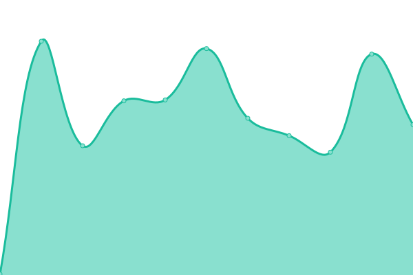

# [📈 Live Status](https://status.incognitus.io): <!--live status--> **🟩 All systems operational**

This repository contains the open-source uptime monitor and status page for [Incognitus](https://incognitus.io), powered by [Upptime](https://github.com/upptime/upptime).

With [Upptime](https://upptime.js.org), you can get your own unlimited and free uptime monitor and status page, powered entirely by a GitHub repository. We use [Issues](https://github.com/Incognitus-Io/status/issues) as incident reports, [Actions](https://github.com/Incognitus-Io/status/actions) as uptime monitors, and [Pages](https://status.incognitus.io) for the status page.

<!--start: status pages-->
<!-- This summary is generated by Upptime (https://github.com/upptime/upptime) -->
<!-- Do not edit this manually, your changes will be overwritten -->

| URL                                                | Status | History                                                                                                         | Response Time                                                                          | Uptime                                                                                                                                                                                                                               |
| -------------------------------------------------- | ------ | --------------------------------------------------------------------------------------------------------------- | -------------------------------------------------------------------------------------- | ------------------------------------------------------------------------------------------------------------------------------------------------------------------------------------------------------------------------------------ |
| [Homepage](https://incognitus.io)                  | 🟩 Up  | [homepage.yml](https://github.com/Incognitus-Io/status/commits/master/history/homepage.yml)                     |  198ms          |                      |
| [Management Console](https://incognitus.io/manage) | 🟩 Up  | [management-console.yml](https://github.com/Incognitus-Io/status/commits/master/history/management-console.yml) |  28ms |  |

<!--end: status pages-->

[**Visit our status website →**](https://status.incognitus.io)

## 📄 License

- Code: [MIT](./LICENSE) © [Incognitus](https://incognitus.io)
- Data in the `./history` directory: [Open Database License](https://opendatacommons.org/licenses/odbl/1-0/)
